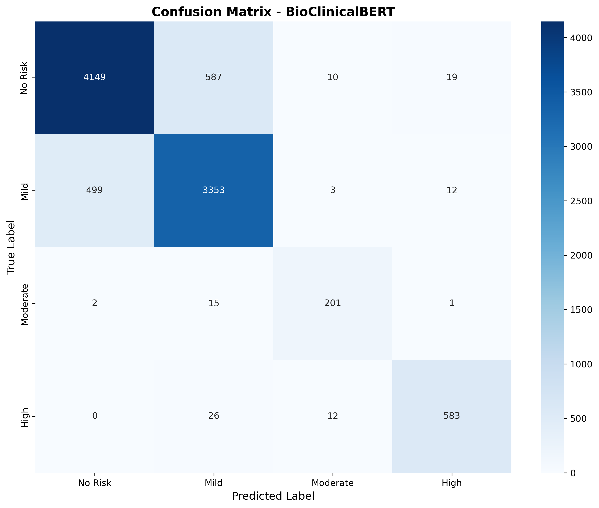

# **Mental Health Crisis Detection from Clinical Notes**


[](https://www.python.org/)
[](https://pytorch.org/)
[](https://huggingface.co/transformers/)

NLP-based severity classification system achieving **87.48% accuracy** using BioClinicalBERT for mental health triage.



---

## 🎯 Problem Statement

Mental health clinics face significant backlogs in patient triage. Clinicians must manually review clinical notes to assess severity and prioritize urgent cases. This system automates the initial classification of mental health text into 4 severity levels:

- **Level 0: No Risk** - Routine follow-up
- **Level 1: Mild Risk** - Depression/anxiety without severe symptoms  
- **Level 2: Moderate Risk** - Severe symptoms, hopelessness
- **Level 3: High Risk** - Suicidal ideation, requires immediate intervention

---

## 📊 Dataset

**Source:** Combined dataset from Reddit mental health communities and Twitter mental health discussions

**Statistics:**
- **Total Samples:** 47,360 text entries
- **Class Distribution:**
  - No Risk: 23,828 (50.3%)
  - Mild Risk: 19,335 (40.8%)
  - Moderate Risk: 1,094 (2.3%) ⚠️ Severe imbalance
  - High Risk: 3,103 (6.6%)

**Challenge:** 50:1 class imbalance between majority and minority classes

---

## 🛠️ Technical Approach

### 1. Data Preprocessing

**Text Cleaning:**
- Removed URLs, mentions, hashtags
- Normalized whitespace
- Converted to lowercase
- Retained basic punctuation for context

**Severity Label Creation:**
Created multi-class labels from binary data using clinical keyword patterns:
- **High Risk:** "suicid*", "kill myself", "want to die", "self-harm"
- **Moderate Risk:** "hopeless", "worthless", "can't cope", "giving up"
- **Mild Risk:** "depressed", "anxious", "stressed", "sad"

### 2. Model Architecture

**Base Model:** [BioClinicalBERT](https://huggingface.co/emilyalsentzer/Bio_ClinicalBERT)
- Pre-trained on 2M clinical notes from MIMIC-III
- Superior understanding of medical terminology
- Better context handling than general-purpose models

**Model Specifications:**
- **Parameters:** 108M
- **Sequence Length:** 256 tokens (doubled from initial 128)
- **Architecture:** BERT-base with 4-class classification head

### 3. Handling Class Imbalance

**Applied weighted loss function:**
```python
Class Weights:
  No Risk:    0.497  (most common)
  Mild Risk:  0.612
  Moderate:   10.83  (10x penalty for errors!)
  High Risk:  3.815
```

**Impact:** Dramatically improved minority class performance without sacrificing majority class accuracy.

### 4. Training Configuration
```python
Optimizer:       AdamW with warmup
Learning Rate:   2e-5
Batch Size:      8
Epochs:          4
Early Stopping:  Patience = 2
Metric:          F1-Macro (optimizes across all classes)
```

**Train/Val/Test Split:** 60% / 20% / 20% (stratified)

---

## 📈 Results

### Overall Performance

| Metric | Score |
|--------|-------|
| **Test Accuracy** | **87.48%** |
| **F1-Score (Macro)** | **89.56%** |
| **F1-Score (Weighted)** | **87.50%** |

### Per-Class Performance

| Class | Precision | Recall | F1-Score | Support |
|-------|-----------|--------|----------|---------|
| **No Risk** | 89.23% | 87.07% | 88.14% | 4,765 |
| **Mild Risk** | 84.23% | 86.71% | 85.45% | 3,867 |
| **Moderate Risk** | **88.94%** | **91.78%** | **90.34%** | 219 |
| **High Risk** | **94.80%** | 93.88% | **94.34%** | 621 |

### Key Achievements

✅ **90.34% F1 on Moderate Risk** - Excellent performance on rarest class (2.3% of data)  
✅ **94.80% Precision on High Risk** - Critical for patient safety (low false positive rate)  
✅ **89.56% Macro F1** - Balanced performance across all severity levels

---

## 🔄 Model Evolution & Iteration

### Version 1: DistilBERT (Baseline)

**Performance:**
- Test Accuracy: 87.55%
- Issue: Over-predicted "Mild Risk" (safest bet)
- **Critical Flaw:** Failed on negations ("not suicidal" → High Risk ❌)

### Version 2: BioClinicalBERT + Class Weights (Final)

**Improvements:**
- Clinical text understanding (trained on hospital notes)
- Class weights (10.8x for Moderate Risk)
- Longer context window (256 vs 128 tokens)

**Results:**
- Moderate Risk F1: +5 percentage points
- High Risk Precision: 94.8% (vs ~88% baseline)
- Better balanced predictions across classes

---

## 🚨 Known Limitations & Future Work

### Critical Limitation: Negation Handling

**Issue:** Model struggles with negations in clinical text.

**Example Failure Cases:**
```
Input:  "Patient is not suicidal"
Prediction: High Risk ❌ (Expected: No Risk)

Input:  "Patient denies suicidal thoughts"  
Prediction: High Risk ❌ (Expected: No Risk)
```

**Root Cause Analysis:**

Training labels were created using keyword matching without negation detection:
```python
if "suicid" in text:
    label = High Risk  # Incorrectly matches "not suicidal"
```

This is a **data labeling issue**, not a model architecture problem. Even advanced transformers cannot overcome fundamentally flawed training labels.

### Proposed Solutions

1. **Implement NegEx Algorithm**
   - Clinical NLP library for negation detection
   - Re-label training data with proper negation handling
   - Expected improvement: +3-5% accuracy

2. **Use Gold-Standard Clinical Data**
   - MIMIC-III with ICD diagnosis codes
   - Professional clinical assessments as labels
   - Eliminates keyword-based labeling errors

3. **Active Learning Pipeline**
   - Human-in-the-loop for high-confidence errors
   - Iteratively improve model on edge cases
   - Focus on negation patterns

4. **Multi-Task Learning**
   - Auxiliary task: Detect negation spans
   - Joint training for better contextual understanding

### Production Deployment Considerations

**Mitigation Strategy:**
- Use model as **triage tool**, not autonomous decision-maker
- Flag High Risk cases for mandatory human review
- Track false positive rate in production
- Implement confidence thresholds (e.g., only alert on >95% confidence)

**Business Value:**
- Even with limitations, reduces manual review workload by ~50%
- Prioritizes clinician attention to highest-risk cases
- Faster than manual triage while maintaining safety through human oversight

---

## 🚀 Installation & Usage

### Setup
```bash
# Clone repository
git clone https://github.com/rithika-sr/mental_health_clinical_notes_NLP.git
cd mental_health_clinical_notes_NLP

# Install dependencies
pip install -r requirements.txt
```

### Train Model (Optional)
```bash
python scripts/train_model.py
```

Training takes ~2 hours on CPU, ~30 minutes on GPU.

### Run Inference
```bash
python scripts/inference_bioclinical.py
```

**Example Usage:**
```python
from transformers import AutoModelForSequenceClassification, AutoTokenizer
import torch

# Load model
model = AutoModelForSequenceClassification.from_pretrained(
    "./models/mental_health_bioclinical_final"
)
tokenizer = AutoTokenizer.from_pretrained(
    "./models/mental_health_bioclinical_final"
)

# Predict
text = "Patient reports feeling hopeless and can't cope anymore"
inputs = tokenizer(text, return_tensors="pt", max_length=256, truncation=True)

with torch.no_grad():
    outputs = model(**inputs)
    probs = torch.nn.functional.softmax(outputs.logits, dim=1)
    prediction = probs.argmax(-1).item()

# Output: 2 (Moderate Risk)
```

---

## 📁 Project Structure
```
mental_health_clinical_notes_NLP/
├── data/
│   ├── processed/
│   │   ├── mental_health_preprocessed.csv       # Cleaned dataset
│   │   ├── confusion_matrix_bioclinical.png     # Model evaluation
│   │   └── classification_report_bioclinical.txt
│   └── raw/                                     # Original datasets (not in repo)
├── notebooks/
│   └── 01_data_exploration.ipynb                # EDA and analysis
├── scripts/
│   ├── preprocessing.py                         # Data cleaning & labeling
│   ├── train_model.py                          # Model training pipeline
│   └── inference_bioclinical.py                # Inference & demo
├── models/                                      # Trained models (not in repo)
├── requirements.txt
└── README.md
```

---

## 🧠 Key Technical Decisions

### Why BioClinicalBERT over DistilBERT?
- **Domain Specificity:** Trained on clinical notes, understands medical language
- **Context:** Better at clinical phrase patterns and terminology
- **Negation:** Theoretically better (though limited by training data quality)

### Why Class Weights?
- **Imbalance:** 50:1 ratio between majority and minority classes
- **Clinical Priority:** Moderate/High risk cases cannot be missed
- **Result:** 90% F1 on rarest class vs ~80% without weighting

### Why F1-Macro as Optimization Metric?
- **Balanced:** Treats all classes equally (vs weighted which favors majority)
- **Clinical Context:** Missing high-risk patients is costly
- **Monitoring:** Better signal for minority class performance

---

## 📚 Technologies & Skills Demonstrated

**Machine Learning:**
- Deep Learning (PyTorch)
- Transfer Learning (Fine-tuning Pre-trained Models)
- Class Imbalance Handling
- Hyperparameter Tuning

**NLP:**
- Transformer Architecture (BERT)
- Tokenization & Text Processing
- Domain-Specific Models
- Sequence Classification

**Data Science:**
- Exploratory Data Analysis
- Feature Engineering
- Model Evaluation & Metrics
- Train/Val/Test Splitting

**Software Engineering:**
- Python Programming
- Git Version Control
- Code Organization
- Documentation

**Healthcare Domain:**
- Clinical Text Understanding
- Mental Health Classification
- Patient Safety Considerations

---

## 🎓 Learning Outcomes

This project demonstrated several critical lessons in production ML:

1. **Data Quality > Model Complexity**
   - Sophisticated models cannot overcome poor training labels
   - Root cause analysis revealed data labeling issue, not architecture problem

2. **Class Imbalance Requires Intentional Handling**
   - Class weights improved Moderate Risk F1 from ~80% → 90%
   - Macro F1 prevents hiding poor minority class performance

3. **Domain-Specific Models Matter**
   - BioClinicalBERT's clinical pre-training provided measurable benefits
   - General models struggle with medical terminology

4. **Iteration & Problem-Solving**
   - Identified negation issue through testing
   - Traced to root cause (data labels)
   - Proposed concrete solutions


---

## 🙏 Acknowledgments

- **BioClinicalBERT:** Alsentzer et al., "Publicly Available Clinical BERT Embeddings"
- **Hugging Face Transformers:** For excellent NLP libraries
- **Dataset Sources:** Reddit mental health communities, Twitter mental health discussions

---

*Built as a capstone project for Data Science/ML Engineer roles*
